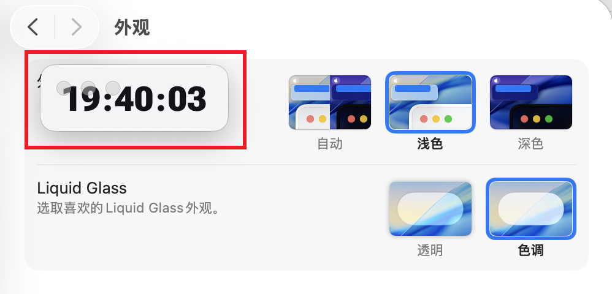
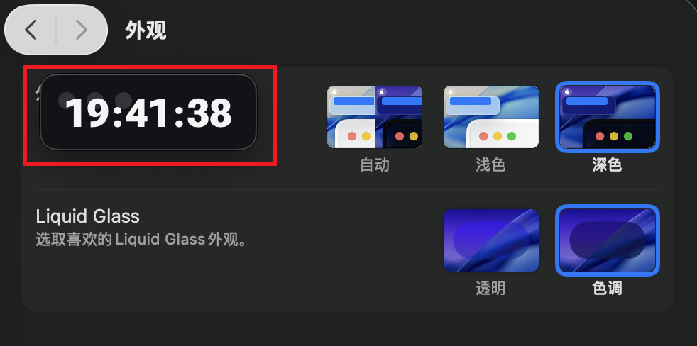

# Floating Clock

A lightweight always-on-top desktop clock for macOS, built with Electron.

## Highlights

- Always-on-top floating clock, visible across workspaces
- Smart light/dark appearance
- Two distributable variants:
  - `SmartClock`: adaptive theme behavior
  - `JustClock`: solid color flat style
- Fast startup, minimal UI

## Theme Behavior

### System Theme Sync

The clock follows macOS light/dark mode for daily desktop usage:

- Light system theme -> light clock background + dark digits
- Dark system theme -> dark clock background + light digits

| Light Mode | Dark Mode |
| --- | --- |
|  |  |

### SmartClock Adaptive Mode

`SmartClock` extends system theme sync with adaptive behavior:

- In normal desktop and split-screen usage: follow macOS theme
- In fullscreen-focused scenarios: try to adapt to foreground visual brightness
- If permissions are unavailable, it automatically falls back to system theme

This keeps the clock readable on dark fullscreen apps while staying consistent in normal workflows.

## Download

Prebuilt DMG packages are published in Releases:

- `SmartClock-1.0.0-arm64.dmg`
- `JustClock-1.0.0-arm64.dmg`

Release page:
https://github.com/kestrel-coder/Floating-Clock/releases/tag/v1.0.0

## Installation (macOS)

1. Download a `.dmg` from Releases
2. Open the `.dmg`
3. Drag the app into `Applications`
4. Launch it from `Applications`

Note: running directly from the mounted DMG is temporary and may cause unexpected behavior. Install to `Applications` first.

## Variants

### SmartClock

- Adaptive behavior for fullscreen and dark-background usage
- Dynamic theme switching based on environment cues

### JustClock

- Stable solid-color flat style
- Pure system-theme-based appearance (no adaptive fullscreen behavior)

## Development

```bash
git clone https://github.com/kestrel-coder/Floating-Clock.git
cd Floating-Clock
npm install
npm start
```

## Build

Package the app for distribution and generate DMG files for macOS sharing.

## Notes

- Current binaries are built for Apple Silicon (`arm64`)
- Some adaptive behaviors may require macOS permissions (Accessibility and Screen Recording), depending on system settings

## License

MIT
