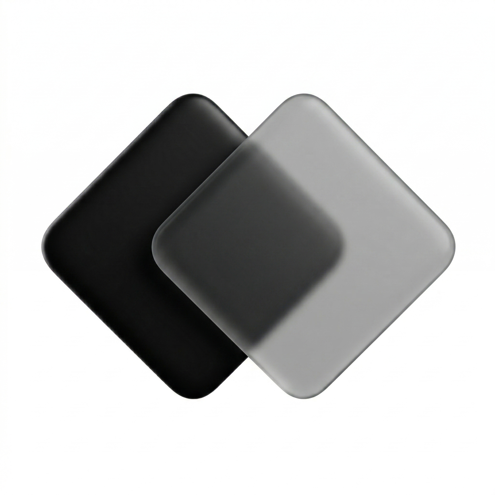

# FloatingClockMac

FloatingClockMac is a lightweight native macOS floating clock built for full-screen work, multi-space setups, and low-friction time checking.

It is designed to stay visible without feeling intrusive:

- Native macOS app built with `Swift`, `AppKit`, and `SwiftUI`
- Always on top
- Visible across Spaces and in full-screen apps
- Menu bar utility with a quick-access status icon
- Resizable and draggable
- Centered `HH:MM:SS` clock with `24-hour` format
- Automatic theme adaptation with screen-sampling fallback to system appearance
- Subtle translucent background and low-contrast traffic lights
- Remembers window size and position
- Automatically enables launch at login on the first packaged-app launch

## Download

If you just want the app:

1. Open the latest release: <https://github.com/kestrel-coder/FloatingClockMac/releases/latest>
2. Download `FloatingClockMac.dmg`
3. Open the disk image and drag `FloatingClockMac.app` into `Applications`
4. Launch the app from `Applications`

Notes:

- The distributed app is outside the App Store.
- If macOS blocks the first launch, right-click the app and choose `Open`.
- To let automatic light/dark switching react to the content behind the clock, allow `Screen Recording` access when macOS asks.
- After enabling `Screen Recording`, reopen the app or use `Refresh Theme` from the menu bar icon.

## Usage

- Drag the clock to move it.
- Resize the window from the edges or corners.
- The clock stays centered as the window changes size.
- Use the menu bar icon to show the clock again, refresh theme detection, open Screen Recording settings, or quit the app.
- On the first packaged launch, the app attempts to register itself for launch at login.
- If you later want to disable startup behavior, remove `FloatingClockMac` from `System Settings > General > Login Items`.

## Local Development

If you want to pull the code and run or modify it locally:

```bash
git clone https://github.com/kestrel-coder/FloatingClockMac.git
cd FloatingClockMac
```

### Requirements

- macOS 13 Ventura or later
- Xcode
- `xcodegen`

If `xcodegen` is missing:

```bash
brew install xcodegen
```

### Generate the Xcode Project

```bash
xcodegen generate
```

### Build from the Command Line

```bash
xcodebuild -project FloatingClockMac.xcodeproj -scheme FloatingClockMac -configuration Debug build
```

### Open in Xcode

```bash
open FloatingClockMac.xcodeproj
```

## Project Layout

- `Sources/FloatingClockApp/`: app source code
- `Resources/`: app icon and bundled assets
- `project.yml`: XcodeGen project definition
- `Package.swift`: Swift Package entry for command-line builds

## License

No license has been added yet. Treat the code as all rights reserved until a license is published.
